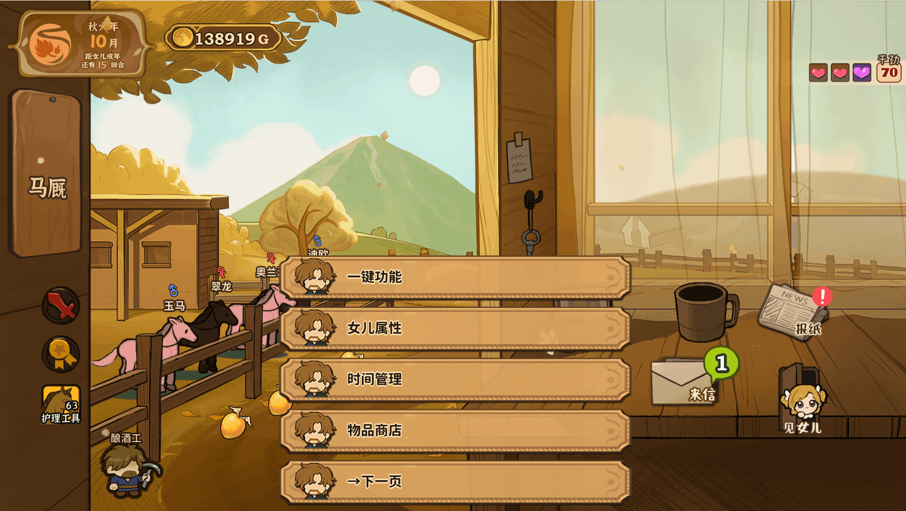
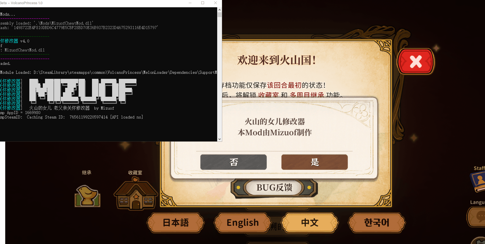

# 火山的女儿 老父亲关怀修改器

火山的女儿 MelonLoader Mod — 游戏内修改面板，按 **F1** 打开。




## 安装方法

### 1. 安装 MelonLoader

下载 MelonLoader.Installer：

[MelonLoader.Installer.exe 直接下载](https://github.com/LavaGang/MelonLoader.Installer/releases/download/4.3.0/MelonLoader.Installer.exe)

> 或用浏览器打开 [Release 页面](https://github.com/LavaGang/MelonLoader.Installer/releases/tag/4.3.0) 自行选择版本。

打开 MelonLoader.Installer，按以下步骤操作：

1. 在列表中找到 **Volcano Princess**（或手动选择游戏 exe）
2. **Install latest**（越新越好，开发环境为 v0.7.2）
3. 安装完成后，**运行一次游戏**，务必进入游戏主界面再退出（首次运行会生成必要文件，速度看网络）
4. 游戏根目录出现 `MelonLoader/` 和 `Mods/` 文件夹即安装成功

> **如果控制台报错或安装失败**：卸载后尝试降低 MelonLoader 版本（例如 v0.7.1）。

### 2. 安装 Mod

将 `MizuofCheatMod.dll` 放入游戏根目录的 `Mods/` 文件夹。

### 3. 启动

启动游戏，进入主界面后按下 **F1** 打开修改面板。

- **F1** — 打开/隐藏修改面板（隐藏后按 F1 恢复原位）
- **F2** — 关闭确认弹窗

## Steam 游戏根目录快速定位

Steam 库 → 右键 **Volcano Princess** → 管理 → 浏览本地文件。

## 功能面板

| 页 | 功能 |
|---|---|
| **Page 1** | 一键功能 · 女儿属性 · 时间管理 · 物品商店 |
| **Page 2** | NPC编辑 · 战斗编辑 · 马匹编辑 |
| **Page 3** | 地图数据 · 结局设定 · 成就设定 |
| **Page 4** | ★游戏规则 · 活动修改 · 其它修改 |

### 子系统一览

| 子系统 | 功能 |
|---|---|
| **一键功能** | 基础属性→9999 / 三维→999 / 资源最大 / 课程全修 / 技能解锁 / 物品添加 / 服装解锁 / 成就 / CG / 地图 / NPC好感 / 恋爱 / 马 / 天赋 / 真结局 |
| **女儿属性** | 4基础属性 + 3三维属性 — 各带详细子面板（+100/+1000/-100/-1000/→0/→500/→9999/→自定义值/→更多数值） |
| **其它属性** | 名望/心情/干劲/灵感/黑暗值/天赋点/父亲好感/恋爱值/身高 — 各有详细设置 |
| **专业分/演艺** | 8专业逐一设置·演艺等级 |
| **时间管理** | 回合跳跃 / 阶段跳跃 / 行动次数 / 能量设置 |
| **物品商店** | ★作弊商店（免费购物） / 关闭商店 / 全部物品 / 服装 / 农场 / 烹饪 / 炼金 / 读书 / 家具 / 魔法商店重置 / 失物 |
| **NPC编辑** | 全体好感/恋爱/剧情/送礼/装备 / 单NPC选编查看 |
| **战斗编辑** | 属性全满 / 一击必杀 / 战斗跳过 / 完全恢复 / 等级 / 经验 / 技能 / 武器 / HP/攻击/防御/闪避/暴击 逐一详细设置 |
| **马匹编辑** | 速度/外貌/加速/加速次数 逐一详细设置 / 好感 / 解锁 / 比赛 / 点数 / 亲密度 |
| **地图数据** | 全地图解锁 / 探索点完成 / 探索等级/次数 详细设置 |
| **结局设定** | 结局列表（可点击触发剧情） / 真结局解锁 / 评分 |
| **成就设定** | 成就 / CG图鉴 / 继承点数 / 服装 / 收藏室评分 |
| **领主修改** | 骑士等级 / 经验 / 任务 / 心愿 |
| **活动修改** | 戏剧 / 约会 / 父亲工作 / 赛马 / 骰子 / 信件 / 笔友信 / 舞蹈 / 画作 / 狩猎 / 辩论 |
| **其它修改** | 烦恼 / 伤病 / 妈妈剧情 / 姓名 / 生日 / 血型 / 教程 / 语言 |
| **★游戏规则** | 实时修改游戏常量：时间/行动/经济/战斗/好感/课程/天赋/马/骰子/心情/探索 — 共11类 |

### 面板深度示例

```
主菜单 Page 1 → 女儿属性
  → 体质 [详细]
    → +100 / +1000 / -100 / -1000 / →0 / →500 / →9999 / →自定义值...
      → 10 / 50 / 100 / 200 / 300 / 400 / 500 / 600 / 700 / 800 / 900 / 1000 / 2000 / 5000 / →更多...
        → 8000 / 9999 / 15000 / 30000 / 50000 / 99999

主菜单 Page 4 → ★游戏规则 → 战斗系统
  → maxFightLevel = 10 / 20 / 29(原版) / 50 / 99
  → teammateNum = 1 / 2 / 3(原版) / 5 / 10
```

## 构建

```bash
dotnet build "MizuofCheatMod/MizuofCheatMod.csproj" --nologo
```

需要 .NET Framework 4.7.2 SDK + MelonLoader 依赖。

## 文件结构

```
MizuofCheatMod/
├── MizuofCheatMod.cs        ← 入口（~30行）
├── ICheatSkill.cs            ← 技能接口
├── HarmonyPatches.cs         ← Harmony 补丁
├── CheatFunctions.cs         ← 游戏操作 API
├── Skills/                   ← 技能模块
│   ├── OneClickSkill.cs
│   ├── AttrSkill.cs          ← 女儿属性（含子子子面板）
│   ├── GameConfigSkill.cs    ← ★游戏规则（炫技功能）
│   └── RemainingSkills.cs    ← 其余11个技能
├── Utils/
│   ├── ModMenu.cs            ← 菜单渲染引擎（5按钮分页）
│   ├── SkillManager.cs       ← 技能注册/路由分发
│   ├── GameReflect.cs        ← 反射封装（Gf/Sf/Inst）
│   └── ModConfig.cs          ← 全局开关状态
└── bin/Debug/net472/
    └── MizuofCheatMod.dll    ← 编译产物
```

## 关于

**作者**: Mizuof  
**B站**: https://space.bilibili.com/516995192/dynamic  
**网站**: www.mizu7.top  

*本修改器完全免费，请勿用于商业用途。*
